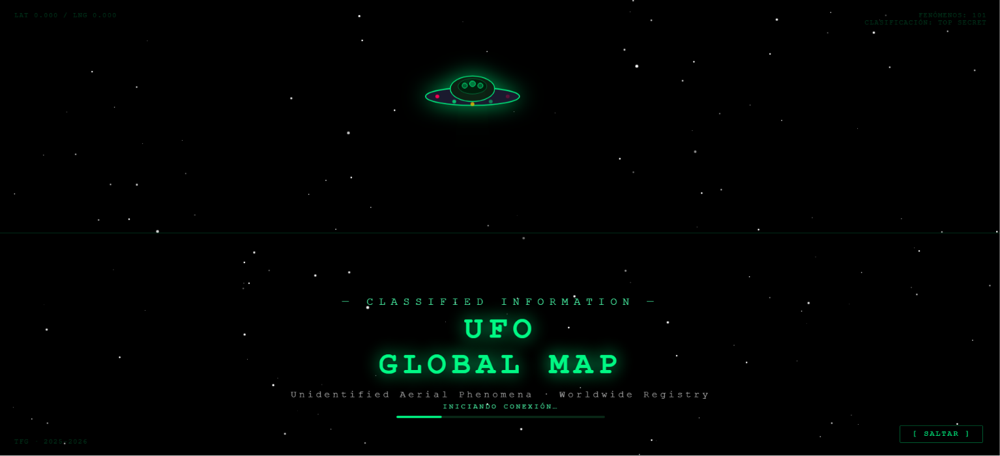
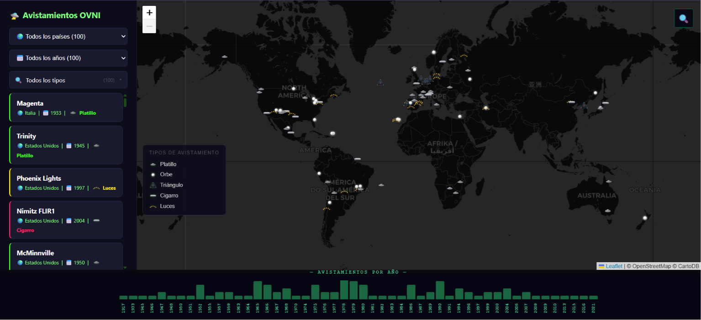
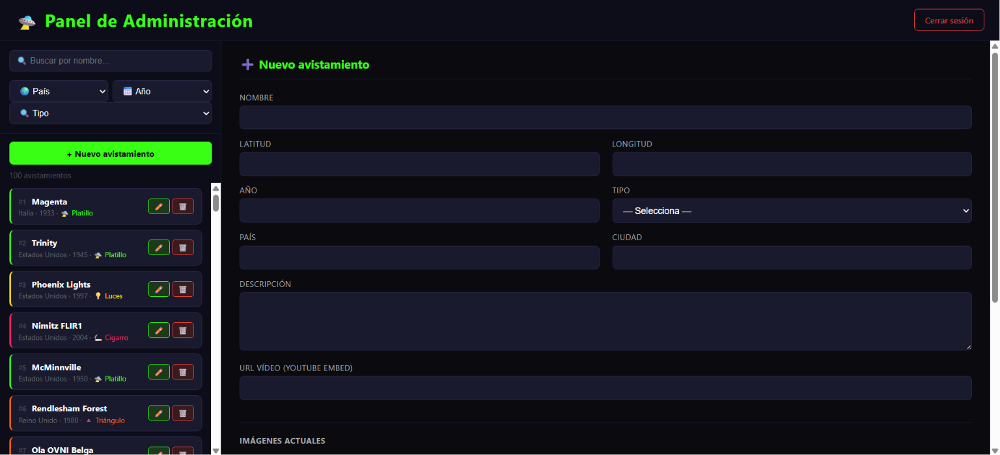

# 🛸 UFO Global Map

Mapa interactivo que visualiza 100 avistamientos OVNI históricos georeferenciados en más de 25 países. Permite filtrar por país, año y tipo de fenómeno, consultar fichas con galería de imágenes y vídeo, buscar casos en tiempo real y navegar una línea de tiempo interactiva. Incluye panel de administración con gestión completa de contenido.

Proyecto desarrollado como **Trabajo de Fin de Grado** del Ciclo Formativo de Grado Superior en **Desarrollo de Aplicaciones Web (DAW)** — IES Clara del Rey, curso 2025/26.

## 📸 Capturas

### Animación de bienvenida


### Mapa principal


### Ficha de detalle (imagen, descripción y vídeo)


### Panel de administración


## ✨ Funcionalidades

- 🗺️ Mapa interactivo con 100 avistamientos georeferenciados, icono y color según el tipo de fenómeno
- 🔎 Filtros dinámicos por país, año (contextual al país) y tipo de avistamiento, con contadores
- 📋 Modal de detalle con galería de imágenes navegable, descripción y vídeo de YouTube embebido
- 📊 Línea de tiempo interactiva sincronizada con los filtros
- 🔍 Buscador en tiempo real sobre el mapa, con texto resaltado
- 🔐 Panel de administración (login por sesión) con CRUD completo: crear, editar y eliminar avistamientos, subida múltiple de imágenes con previsualización

## 🛠️ Tecnologías

| Tecnología | Uso |
|---|---|
| HTML5 / CSS3 | Estructura y estilos |
| JavaScript (ES6, sin frameworks) | Lógica de cliente: mapa, filtros, modal, buscador, timeline |
| [Leaflet.js](https://leafletjs.com/) | Mapa interactivo |
| PHP | Backend: API JSON, login, panel admin, gestión de imágenes |
| MySQL | Base de datos (100 registros) |
| XAMPP | Servidor local de desarrollo |

## 🚀 Instalación local

1. Clona el repositorio dentro de tu carpeta `htdocs` de XAMPP:
```bash
   git clone https://github.com/avarona94/ufo-global-map.git
```
2. Crea la base de datos `ovni_db` en phpMyAdmin e importa el archivo `avistamientos.sql`
3. Copia `config.example.php` como `config.php` y define tu usuario/contraseña de administrador:
```php
   define('ADMIN_USER', 'tu_usuario');
   define('ADMIN_PASS', 'tu_contraseña');
```
4. Arranca Apache y MySQL desde el panel de XAMPP
5. Abre `http://localhost/ufo-global-map/` en el navegador
6. Para acceder al panel de administración: `http://localhost/ufo-global-map/login.php`

## 📂 Estructura del proyecto

├── index.html          # Mapa, filtros, modal y leyenda

├── style.css            # Estilos

├── app.js                # Carga de datos, mapa, filtros, modal

├── buscador.js          # Buscador en tiempo real

├── timeline.js          # Línea de tiempo

├── welcome.js           # Animación de bienvenida

├── avistamientos.php   # API JSON

├── admin.php             # Panel de administración

├── login.php / logout.php

├── config.example.php  # Plantilla de configuración (copiar como config.php)

├── avistamientos.sql   # Estructura y datos de la base de datos

├── img/                  # Iconos SVG por tipo de avistamiento


## 📚 Fuentes de datos

Casos históricos documentados a partir de [NUFORC](https://nuforc.org/) y Wikipedia. Coordenadas verificadas manualmente.

## 📄 Licencia

MIT License — ver [LICENSE](LICENSE)

---

**Autor:** Álvaro Varona — [GitHub](https://github.com/avarona94)
